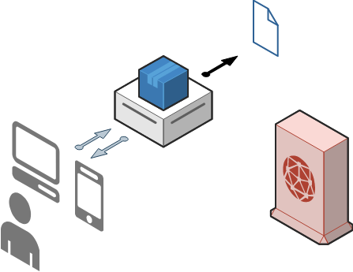
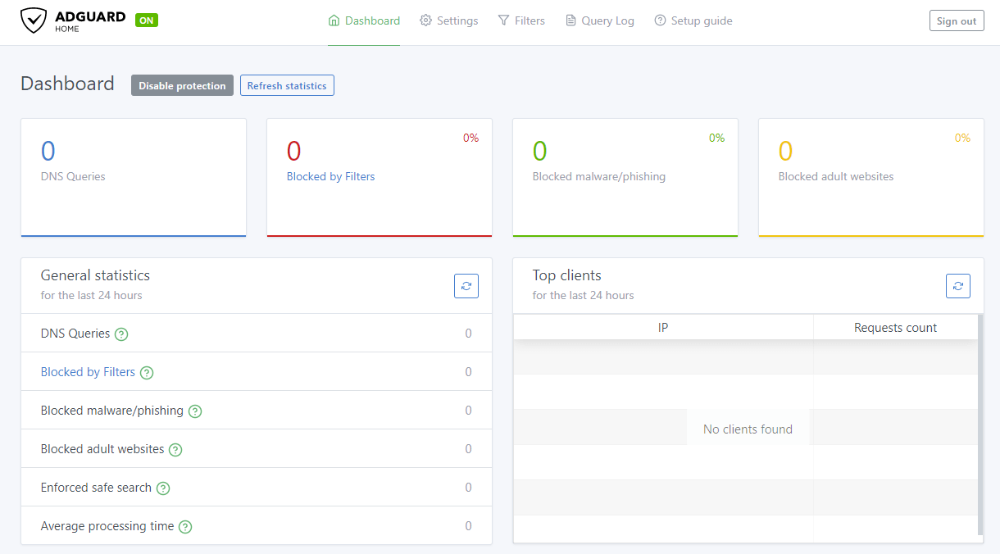

Le DNS Sinkhole constitue un bouclier efficace contre les contenus en ligne indésirables, sans qu'il soit nécessaire d'installer un logiciel côté client. 
Dans cet article, nous verrons comment fonctionnent les DNS Sinkholes, quels sont leurs avantages et quelles sont les deux principales solutions : Pi-Hole et AdGuard.

## Introduction

### Filtrage

Le filtrage des requêtes DNS joue un rôle dans le renforcement de la sécurité en ligne et la protection de notre vie privée. 

En interceptant et en examinant minutieusement les requêtes DNS, nous pouvons bloquer de manière proactive les menaces potentielles et les menaces de sécurité avant même qu'elles n'atteignent nos appareils. Cela nous protège non seulement des sites web malveillants et des tentatives d'hameçonnage, mais ajoute également une couche supplémentaire de défense contre les cyberattaques telles que la distribution de logiciels malveillants et de ransomwares.

De plus, le filtrage DNS permet aux internautes de prendre le contrôle de leur vie privée en ligne en déjouant les scripts avides de données employés par les grandes entreprises pour collecter et monétiser nos informations personnelles. En bloquant ces renifleurs de vie privée, nous pouvons réduire le risque que nos données soient exploitées à des fins de publicité ciblée ou à d'autres fins intrusives. 

Enfin, le filtrage DNS est un outil puissant pour éliminer le barrage incessant de publicités qui encombrent notre expérience de navigation. Non seulement il améliore notre efficacité en ligne, mais il minimise également l'exposition à des publicités potentiellement trompeuses ou nuisibles. 

En résumé, le filtrage DNS est un gardien polyvalent de notre monde numérique, qui renforce notre sécurité, préserve notre vie privée et désencombre notre paysage en ligne.

### Requêtes DNS

Les requêtes DNS (Domain Name System) jouent un rôle crucial dans la conversion des adresses web (par exemple, duckduckgo.com) en adresses IP compréhensibles par vos appareils (par exemple, 40.114.177.156).

{{}}

Le DNS Sinkhole fonctionne comme un intermédiaire entre votre serveur DNS et les appareils clients, tels que les ordinateurs, les téléviseurs, les tablettes et les téléphones. Selon la configuration de votre DNS Sinkhole, il peut accepter ou refuser des requêtes sur la base d'une liste DNS Sinkhole.

Les DNS Sinkhole classent les requêtes en deux listes : la liste d'autorisation et la liste de blocage.



<hr>
---



>  DNS-Sinkhole
>  DNS-Sinkhole List 
>  DNS Server 
>  DNS-Sinkhole Request/Response
>  DNS Request/Response

#### Liste DNS-Sinkhole

Voici un exemple de listes DNS-Sinkhole :

```sh
amptrack.dailymail.co.uk #DailyMail Tracker
analytics.gandi.net #Gandi
analytics.yahoo.com #Yahoo
arc.msn.com #Microsoft
areyouahuman.com #Are You A Human
atdmt.com #Facebook
#...
```

Par défaut, les DNS Sinkhole utilise ses propre listes, mais vous pouvez facilement en ajouter d'autres à partir de sources comme GitHub. J'ai créé mes propres listes et je les partage sur GitHub à l'adresse [Ealenn/AdGuard-Home-List](https://github.com/Ealenn/AdGuard-Home-List), qui convient à une utilisation en entreprise et combine des listes populaires.

Pour configurer AdGuard Home, utilisez son menu principal pour ajouter une liste de blocage et une liste d'autorisation :

BlockList :
- https://raw.githubusercontent.com/Ealenn/AdGuard-Home-List/gh-pages/AdGuard-Home-List.Block.txt

AllowList :
- https://raw.githubusercontent.com/Ealenn/AdGuard-Home-List/gh-pages/AdGuard-Home-List.Allow.txt

### Redondance des serveurs DNS

Un autre avantage des DNS Sinkhole est la disponibilité de plusieurs serveurs DNS.

Si un serveur DNS devient inaccessible, votre système peut automatiquement basculer sur un autre. Cette redondance est cruciale dans des scénarios tels que les attaques DDoS, comme on l'a vu [lors de la cyberattaque de Dyn en 2016](https://fr.wikipedia.org/wiki/Cyberattaque_de_2016_contre_Dyn) et lors de la panne du fournisseur d'accès à Internet français Free DNS en 2018.



Personnellement, j'utilise :

- Cloudflare, le résolveur DNS le plus rapide de la planète
- Google
- Cisco Open DNS

```sh
# AdGuard
94.140.14.14
94.140.15.15
https://dns.adguard.com/dns-query
tls://dns.adguard.com
# Cloudflare DNS
1.1.1.1
1.0.0.1
https://dns.cloudflare.com/dns-query
tls://1.1.1.1
# Google
8.8.8.8
8.8.4.4
https://dns.google/dns-query
tls://dns.google
# Cisco OpenDNS
208.67.222.222
208.67.220.220
https://doh.opendns.com/dns-query
# Dyn DNS
216.146.35.35
216.146.36.36
```

## Concrètement

### Leaders de l'Open Source

#### Pi-Hole


- Maintenu par des développeurs des États-Unis, du Canada, d'Angleterre, d'Allemagne et d'Australie
- Il s'appuie sur une communauté importante pour faciliter l'assistance
- Les listes de blocage et les listes d'autorisation sont régulièrement mises à jour et maintenues par les développeurs.

#### AdGuard


- La plupart des développeurs sont situés à Moscou, en Russie
- Interface plus propre que celle de Pi-Hole
- Utilise moins de ressources système (RAM)
- Supporte le DNS-Over-HTTPS

### Interface Web

Pi-Hole et AdGuard proposent tous deux des tableaux de bord d'apparence similaire, accessibles via un navigateur web.
Ces tableaux de bord fournissent des statistiques et des graphiques utiles concernant l'efficacité des bloqueurs de publicité.


### Pi-Hole

---
### AdGuard



### Installation


**Note**: Assurez-vous que votre routeur (ou serveur DHCP) attribue une adresse IP statique à votre DNS.



#### Pi-Hole

Pour plus d'informations, se référer à la documentation officielle de Pi-Hole [ici](https://docs.pi-hole.net/).

``` yml
version: "3"
services:
  pihole:
    container_name: pihole
    image: pihole/pihole
    ports:
      - "53:53/tcp"
      - "53:53/udp"
      - "67:67/udp"
      - "8000:80/tcp"
      - "4443:443/tcp"
    environment:
      TZ: 'Europe/Paris'
      WEBPASSWORD: 'Password used for Web Administration'
      ServerIP: 'IP of Pi-Hole'
    volumes:
      - './etc-pihole/:/etc/pihole/'
      - './etc-dnsmasq.d/:/etc/dnsmasq.d/'
    dns:
      - 1.1.1.1
      - 8.8.8.8
      - 8.8.4.4
    cap_add:
      - NET_ADMIN
    restart: unless-stopped
```
---
#### AdGuard

Pour plus d'informations, se référer à la documentation officielle de Pi-Hole [ici](https://kb.adguard.com/en/home/overview).

``` yml
version: "3" 
services:
  adguard:
    container_name: adguardhome
    image: adguard/adguardhome
    ports:
      - "53:53/tcp"
      - "53:53/udp"
      - "67:67/udp"
      - "68:68/tcp"
      - "68:68/udp"
      - "8000:80/tcp"
      - "4443:443/tcp"
      - "853:853/tcp"
      - "3000:3000/tcp"
    volumes:
      - ./workdir:/opt/adguardhome/work
      - ./confdir:/opt/adguardhome/conf
    dns:
      - 1.1.1.1
      - 8.8.8.8
      - 8.8.4.4
    cap_add:
      - NET_ADMIN
    restart: unless-stopped
```


---

Deux options s'offrent à vous pour la mise en œuvre :
- l'utiliser comme serveur DHCP pour une configuration automatique 
- ou configurer manuellement le serveur DNS sur vos appareils pour utiliser l'adresse IP de votre Raspberry Pi.

> **Personnellement, j'ai configuré mes appareils pour qu'ils utilisent le serveur DNS.**

## Retour d'expérience

Après avoir utilisé Pi-Hole pendant six mois et AdGuard pendant six mois supplémentaires, les deux solutions se sont avérées presque identiques.
Cependant, AdGuard Home offre une interface plus attrayante et une configuration de DNS-Over-HTTPS facile.

Il est important de noter que les DNS sinkholes ne peuvent pas bloquer toutes les publicités ou tous les contenus indésirables, car certains domaines ont des objectifs multiples. Pour l'instant, des domaines comme Facebook, YouTube ou Google ne peuvent pas être entièrement bloqués sans causer des problèmes de fonctionnalité. 

Néanmoins, les DNS sinkholes peuvent bloquer efficacement une grande partie du contenu indésirable. Sur mon réseau, avec AdGuard, environ 10 à 20 % des requêtes DNS sont refusées, ce qui permet de bloquer efficacement les publicités et d'améliorer la confidentialité.


Publicités
- adservice.google.com
- ads.yahoo.com
- ...
---
Vie privée
- metrics.***.com
- app-measurement.com
- analytics.***.com
- privatestats.whatsapp.net
- ...

