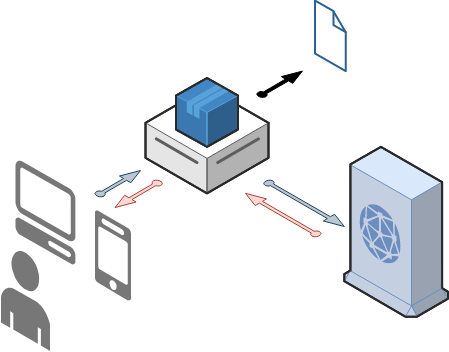
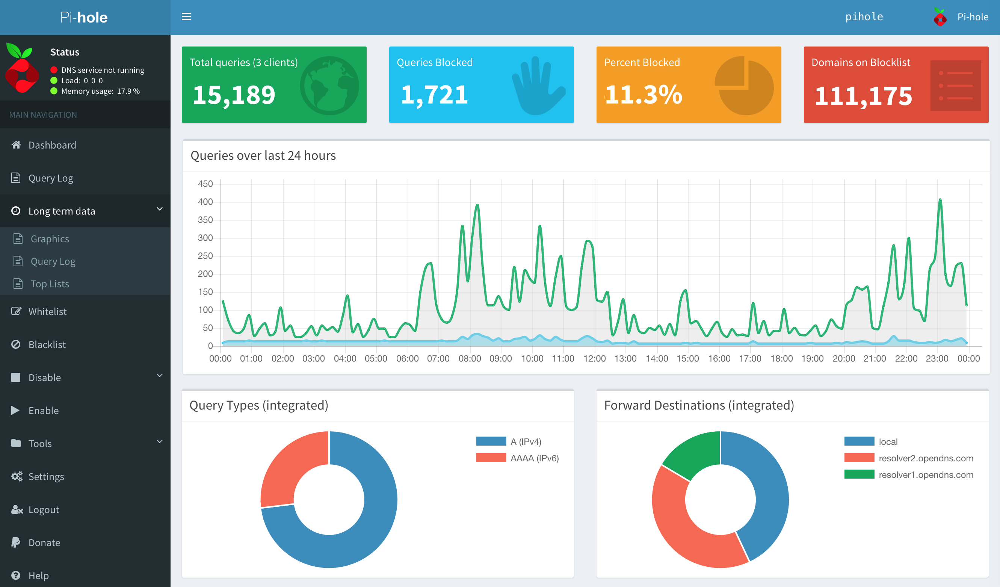
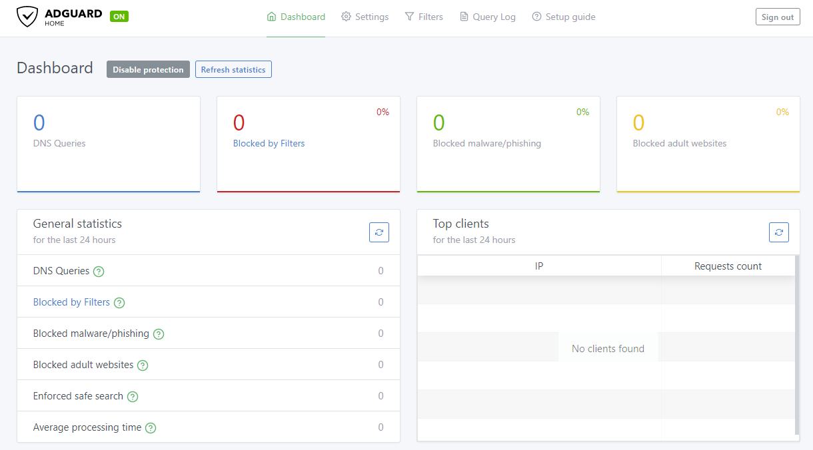

An DNS sinkhole that protects your devices from unwanted content, without installing any client-side software.

## Presentation

### Filter your DNS queries

An DNS querie is used to convert a web address (duckduckgo.com) by an IP address usable by your computer (40.114.177.156)

{{}}

DNS-Sinkhole is placed between the DNS server, and your client (Computer, TV, tablet, phone etc ...) Depending on the configuration of your DNS-Sinkhole, it can accept the request, or refuse it, based on DNS-Sinkhole List.



<hr>
---



>  DNS-Sinkhole
>  DNS-Sinkhole List 
>  DNS Server 
>  DNS-Sinkhole Request/Response
>  DNS Request/Response

#### DNS-Sinkhole List

Here is a sample of DNS-Sinkhole List

```sh
amptrack.dailymail.co.uk #DailyMail Tracker
analytics.gandi.net #Gandi
analytics.yahoo.com #Yahoo
arc.msn.com #Microsoft
areyouahuman.com #Are You A Human
atdmt.com #Facebook
#...
```

By default the DNS-Sinkhole uses their own list, but you can add a lot of them, simply with a search on github.

I share my lists on a GitHub [Ealenn/AdGuard-Home-List](https://github.com/Ealenn/AdGuard-Home-List). **This list can easily be used in corporate.** This is the list that is configured in my home, and I use every day. It brings together the most famous lists.

Once you have AdGuard Home ready and are logged in, use its main menu to add one blocklist and one allowlist.

BlockList :
- https://raw.githubusercontent.com/Ealenn/AdGuard-Home-List/gh-pages/AdGuard-Home-List.Block.txt

AllowList :
- https://raw.githubusercontent.com/Ealenn/AdGuard-Home-List/gh-pages/AdGuard-Home-List.Allow.txt

### Redundancy of DNS servers

Another advantage is the multiplication of DNS servers available. If an DNS server is no longer accessible, for example your internet service provider, you switch to another automatically.

> Example, in case of DDoS cyberattack [as in 2016 with Dyn](https://en.wikipedia.org/wiki/2016_Dyn_cyberattack), Dyn is not accessible, but CloudFlare is up ! More recently in 2018 with the French internet service provider Free, and they national DNS breakdown.



Personally I use :

- Cloudflare, the fastest DNS resolver on Earth
- Google
- Cisco Open DNS

```sh
# AdGuard
94.140.14.14
94.140.15.15
https://dns.adguard.com/dns-query
tls://dns.adguard.com
# Cloudflare DNS
1.1.1.1
1.0.0.1
https://dns.cloudflare.com/dns-query
tls://1.1.1.1
# Google
8.8.8.8
8.8.4.4
https://dns.google/dns-query
tls://dns.google
# Cisco OpenDNS
208.67.222.222
208.67.220.220
https://doh.opendns.com/dns-query
# Dyn DNS
216.146.35.35
216.146.36.36
```

## Concretely

### Open Source Leaders

#### Pi-Hole


- developers are located in the US, Canada, England, Germany and Australia
- has a bigger community, so you can easily find help if you need it
- block-lists and allow-lists are constantly updated and maintained by the maintainers

#### AdGuard


- most of the developers are still located in Moscow (Russia)
- had a cleaner Interface compared to Pi-Hole
- uses fewer resources (RAM)
- support of DNS-Over-HTTPS

### Web Interface

Pi-Hole and AdGuard have similar-looking main dashboard which is accessed via a web browser. You get to see a few nice graphs and statistics on how well the blockers are performing.


### Pi-Hole

---
### AdGuard



### Installation


You must configure your box (or DHCP server) to assign static IP of your DNS-Sinkhole



#### Pi-Hole

[More information](https://docs.pi-hole.net/) in official Pi-Hole documentation

``` yml
version: "3"
services:
  pihole:
    container_name: pihole
    image: pihole/pihole
    ports:
      - "53:53/tcp"
      - "53:53/udp"
      - "67:67/udp"
      - "8000:80/tcp"
      - "4443:443/tcp"
    environment:
      TZ: 'Europe/Paris'
      WEBPASSWORD: 'Password used for Web Administration'
      ServerIP: 'IP of Pi-Hole'
    volumes:
      - './etc-pihole/:/etc/pihole/'
      - './etc-dnsmasq.d/:/etc/dnsmasq.d/'
    dns:
      - 1.1.1.1
      - 8.8.8.8
      - 8.8.4.4
    cap_add:
      - NET_ADMIN
    restart: unless-stopped
```
---
#### AdGuard

[More information](https://kb.adguard.com/en/home/overview) in official AdGuard Home documentation

``` yml
version: "3" 
services:
  adguard:
    container_name: adguardhome
    image: adguard/adguardhome
    ports:
      - "53:53/tcp"
      - "53:53/udp"
      - "67:67/udp"
      - "68:68/tcp"
      - "68:68/udp"
      - "8000:80/tcp"
      - "4443:443/tcp"
      - "853:853/tcp"
      - "3000:3000/tcp"
    volumes:
      - ./workdir:/opt/adguardhome/work
      - ./confdir:/opt/adguardhome/conf
    dns:
      - 1.1.1.1
      - 8.8.8.8
      - 8.8.4.4
    cap_add:
      - NET_ADMIN
    restart: unless-stopped
```


---

Two solutions now, use it as a DHCP server and everything is automatic... 
Or configure the DNS server on your devices and set IP address of your raspberry. 

> Personally, I have configured my devices to use the DNS server

## Feedback

I was used Pi-Hole during 6 mounth, then AdGuard during 6 mounth.

The two solution are almost identical, otherwise AdGuard does the job very well, and the interface is even nicer.

I still prefer AdGuard Home, because DNS-Over-HTTPS is available and easy to set up.

The "problem" stems from the **principle of DNS-Sinkhole**. You can't really block all the ads or junk. Because some domains are not dedicated only to advertising or privacy sniffing... Example with Facebook, Youtube or Google.

You can block **A LOT** of things. And it is not negligible. 

Today approximately 10-20 percent of DNS requests are refused on my network with AdGuard.


Ads
- adservice.google.com
- ads.yahoo.com
- ...
---
Privacy
- metrics.***.com
- app-measurement.com
- analytics.***.com
- privatestats.whatsapp.net
- ...


